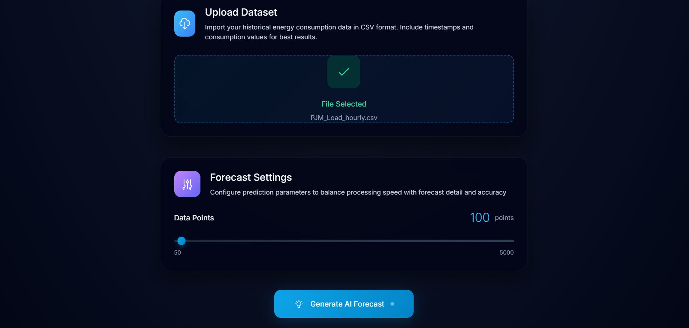
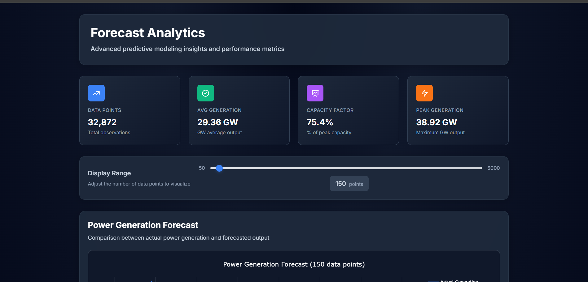
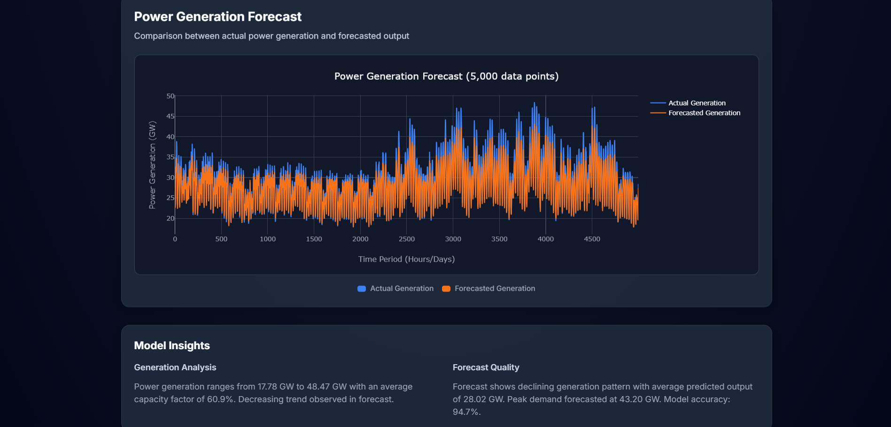

# Forecast Analytics Platform

## Project Overview
**Forecast Analytics Platform** is an interactive web dashboard designed to **visualize and analyze power generation forecasts**. It compares actual vs forecasted outputs, shows trends, peak values, and other key insights. The platform helps users make data-driven decisions for energy systems.  

Built with:
- **HTML, TailwindCSS** – for responsive, modern design  
- **Plotly.js** – for interactive charts  
- **Flask** – Backend

---

## Features
- **Interactive Charts:** Compare actual vs forecasted power generation  
- **Display Range Slider:** Adjust the number of data points visualized  
- **Key Insights Cards:** Show total observations, trend direction, peak values  
- **Responsive Design:** Works on desktop and tablet devices  
- **Dark/Light Mode Compatible**  

---

## Screenshots
<!-- Replace with your actual images -->
### Main dashboard showing forecast vs actual generation

### Trend analysis and peak value insights

---
