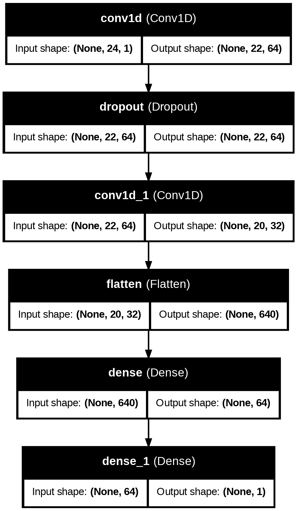

# Forecast Analytics Platform

---

## Project Overview
**Forecast Analytics Platform** is an interactive web dashboard designed to **visualize and analyze power generation data**. It allows users to compare **actual vs predicted outputs based on the available dataset**, monitor trends, identify peak values, and gain actionable insights.  

While the current version predicts within the dataset, **true future forecasting will be integrated in future updates** 

**Key Goals:**
- Enable **visual comparison of predicted vs actual data**  
- Highlight **trends, peaks, and deviations**  
- Provide insights for operational analysis and planning  
- Serve as a **foundation for future AI/ML-based forecasting**

---

## Technology Stack
- **Frontend:** HTML, TailwindCSS – modern, responsive design  
- **Visualization:** Plotly.js – interactive charts and dashboards  
- **Backend:** Flask – serving API endpoints and handling data  
- **AI/ML:** Current model predicts outputs **based on the existing dataset**  
- **Future AI/ML Enhancements:** Time series forecasting for future power generation

---

## Features
- **Interactive Charts:** Compare actual vs predicted values for the dataset  
- **Range Slider:** Adjust the number of data points displayed  
- **Key Insights Cards:** Show total observations, trend direction, peak generation  
- **Data Analysis Ready:** Easily integrates with more ML models in the future  
- **Responsive Design:** Works on desktop and tablet devices  
- **Dark/Light Mode Compatible**

---

## Model Architecture

The current model predicts outputs **based on historical dataset values**, allowing visualization of predicted vs actual values for analysis purposes.  

- **Input Features:** Historical power output, environmental parameters  
- **Output:** Predicted power values within the dataset  
- **Future Integration:** True forecasting of future values and anomaly detection

---

## Screenshots

### Main dashboard showing predicted vs actual generation

### Trend analysis and peak value insights

---

